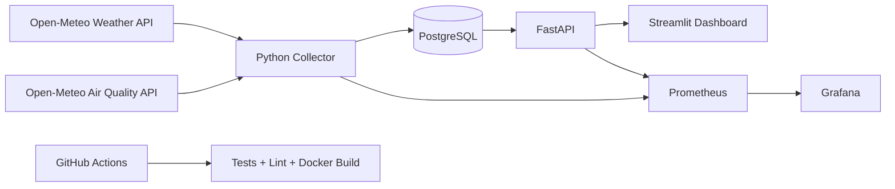

# Real-Time Environmental Intelligence DevOps Platform

Plataforma DevOps completa para coleta, processamento, armazenamento, visualização e monitoramento de dados ambientais em tempo real.

O projeto coleta dados reais da web sobre clima e qualidade do ar, salva em PostgreSQL, disponibiliza uma API com FastAPI, exibe um dashboard em Streamlit e monitora tudo com Prometheus e Grafana.

## Objetivo

Criar um projeto visual, robusto e fácil de executar para GitHub e LinkedIn, demonstrando habilidades modernas em DevOps, dados em tempo real, observabilidade e automação.

## Tema escolhido

Monitoramento ambiental em tempo real usando dados públicos de clima e qualidade do ar.

Esse tema é forte para recrutadores porque une:

- DevOps
- Engenharia de Dados
- APIs em tempo real
- Observabilidade
- ESG
- Cidades inteligentes
- Automação com Linux e Docker

## Arquitetura



## Ferramentas utilizadas

| Camada | Ferramenta |
|---|---|
| Sistema | Linux Ubuntu |
| Containers | Docker e Docker Compose |
| Backend | FastAPI |
| Coleta | Python + Requests + Tenacity |
| Banco | PostgreSQL |
| Dashboard | Streamlit + Plotly |
| Métricas | Prometheus |
| Observabilidade | Grafana |
| CI/CD | GitHub Actions |
| Testes | Pytest |
| Qualidade | Ruff |

## O que o projeto faz

- Coleta dados reais de clima e qualidade do ar pela web.
- Monitora cidades brasileiras configuráveis.
- Salva histórico em PostgreSQL.
- Classifica risco ambiental em LOW, MODERATE, HIGH e CRITICAL.
- Exibe dashboard visual para visitantes.
- Disponibiliza API documentada automaticamente.
- Expõe métricas para Prometheus.
- Cria painel no Grafana.
- Possui pipeline CI/CD no GitHub Actions.

## Como rodar no Linux

### 1. Instalar dependências básicas

```bash
chmod +x scripts/bootstrap-linux.sh
./scripts/bootstrap-linux.sh
```

### 2. Criar arquivo de ambiente

```bash
cp .env.example .env
```

### 3. Subir o projeto

```bash
docker compose up --build -d
```

Ou usando Makefile:

```bash
make setup
make up
```

## Acessos locais

| Serviço | URL |
|---|---|
| Dashboard | http://localhost:8501 |
| API Swagger | http://localhost:8000/docs |
| Healthcheck | http://localhost:8000/health |
| Prometheus | http://localhost:9090 |
| Grafana | http://localhost:3000 |

Usuário Grafana:

```text
admin
```

Senha Grafana:

```text
admin
```

## Endpoints principais

```http
GET /health
GET /cities
GET /readings/latest
GET /readings/{city}
GET /metrics
```

## Personalizar cidades

Edite a variável `CITIES` no arquivo `.env`:

```env
CITIES=Fortaleza,-3.7319,-38.5267;Sao Paulo,-23.5505,-46.6333
```

Formato:

```text
Nome,latitude,longitude;Nome,latitude,longitude
```

## Comandos úteis

```bash
make logs       # acompanhar logs
make test       # rodar testes
make lint       # validar qualidade
make down       # parar containers
make clean      # remover volumes e reiniciar do zero
```

## Por que este projeto é sênior

Este não é apenas um dashboard. Ele mostra uma arquitetura completa:

- Coleta real de dados externos.
- Tratamento de falhas com retry.
- Persistência com banco relacional.
- API desacoplada.
- Dashboard separado.
- Observabilidade com métricas reais.
- CI/CD automatizado.
- Execução reproduzível via Docker.
- Documentação clara para visitantes.

## Próximas melhorias sugeridas

- Deploy em cloud: Azure, AWS, GCP ou Oracle Cloud.
- Kubernetes com Helm.
- Terraform para infraestrutura.
- Alertas por Telegram, WhatsApp ou e-mail.
- Camada Kafka/Redpanda para streaming distribuído.
- Autenticação no dashboard.
- Machine Learning para previsão de risco ambiental.

## Autor

Projeto criado para portfólio DevOps, GitHub e LinkedIn.
