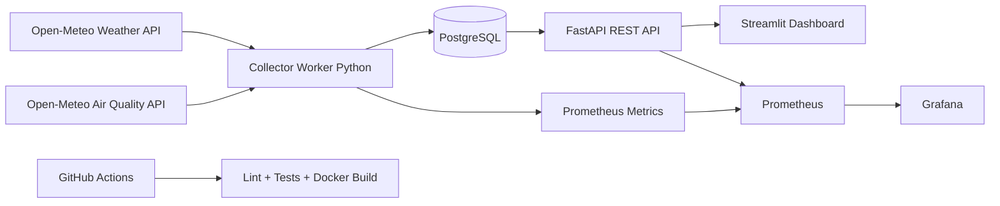

# Arquitetura

## Serviços

- **collector**: coleta dados reais da web em intervalos configuráveis.
- **postgres**: persiste histórico para consultas e gráficos.
- **api**: disponibiliza endpoints REST e métricas Prometheus.
- **dashboard**: interface visual para visitantes e recrutadores.
- **prometheus/grafana**: observabilidade, disponibilidade e métricas.

## Critérios de estabilidade

- Healthchecks em containers críticos.
- Retry exponencial em chamadas web.
- Pool de conexão com PostgreSQL.
- Coleta resiliente por cidade: erro em uma cidade não interrompe as demais.
- Métricas de sucesso e falha do coletor.
